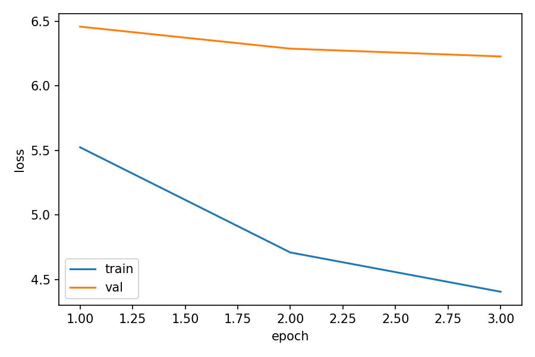
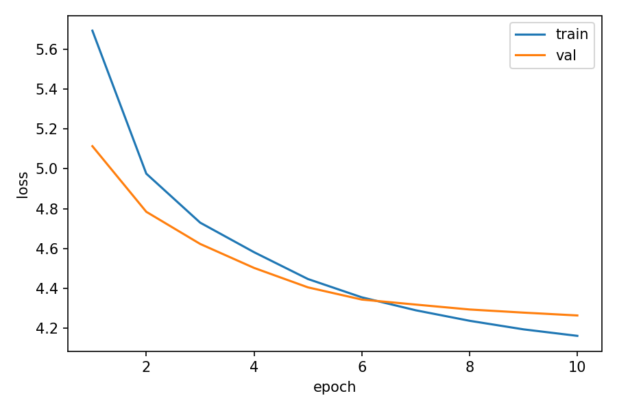
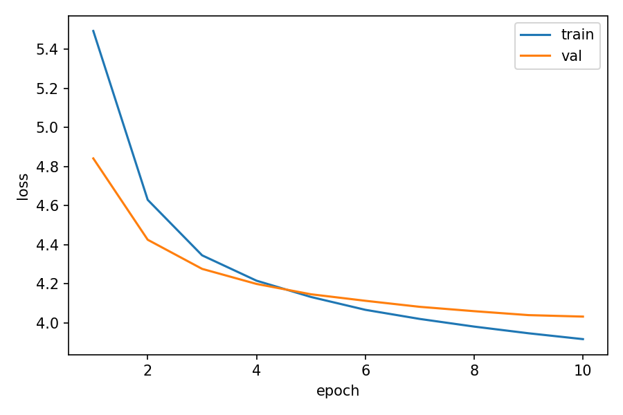
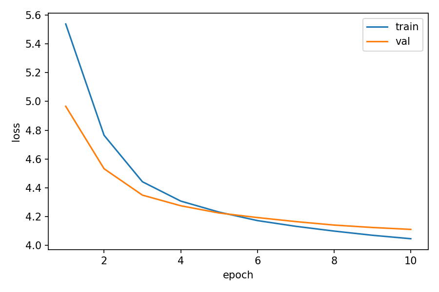
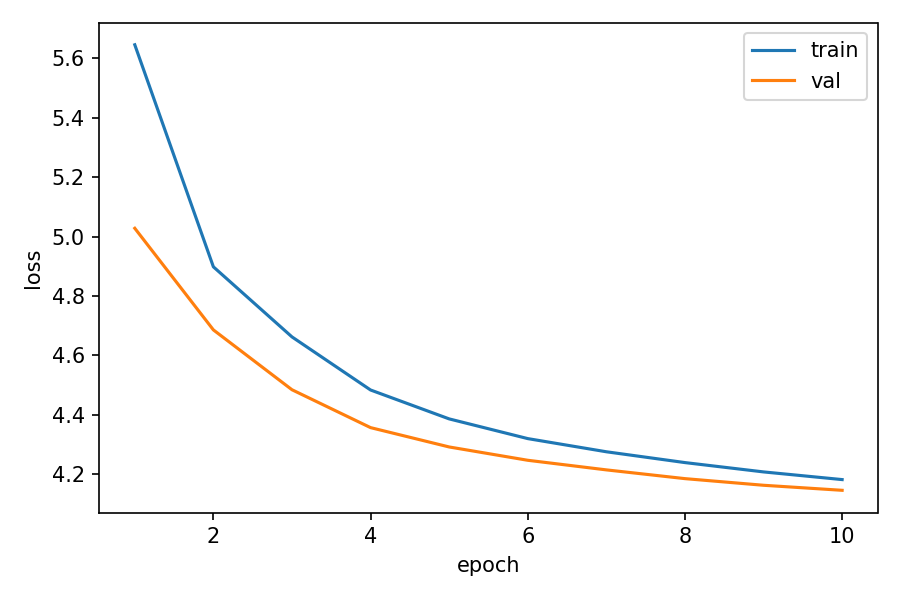
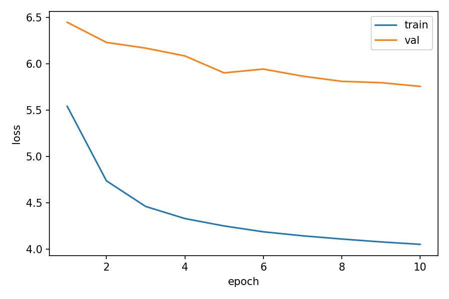

# 实验报告：手搓因果注意力、前馈子层与古诗续写（字符级 GPT）

> 姓名：____　学号：____　日期：2026-06-__

---

## 一、实验概述

本实验在给定的小型 Decoder-only Transformer（CharGPT）框架上，亲手补全了两处核心子层：

1. **`CausalSelfAttention.forward`**：多头 Q/K/V、缩放点积、因果掩码、softmax、加权求和、合并多头与输出投影；
2. **`FeedForward`（`__init__` + `forward`）**：d_model → d_ff → GELU → d_model，带 Dropout。

在唐宋古诗语料上以"预测下一个字"为目标完成训练，最终在全量 23.5 万首语料上取得 **验证集 loss 4.03（d_model=384 配置）**，并完成了 temperature 对比与超参对比两个加分实验。此外，自主进行了"训练窗口诗头对齐"的数据工程改进，期间定位并修复了两个由分布不匹配引起的问题（生成超长后紊乱、验证指标虚高），相关分析见第八节。

## 二、环境与数据准备

- **环境**：Python 3.x + PyTorch（conda 环境），GPU 训练（CUDA）；`pip install -r requirements.txt`。
- **数据**：Hugging Face `Lifan-Z/Chinese-poetries-txt`（经 hf-mirror 镜像下载）。源数据集共 **234,720 首**。初期按脚本默认抽样 10 万首；后将 `n_samples` 上调为全量使用（见第八节实验 3）。
- **预处理**（`prepare_data.py`）：每首诗一行写入 `poetry.txt`；以"语料中实际出现过的字符集合"构建字符级词表（全量语料下 **vocab_size = 9408**）；按 9:1 划分训练/验证集，编码为 `train_data.pt` / `val_data.pt`。
- **数据组织**（`dataset.py`）：在编码后的长序列上取长度为 `block_size=128` 的窗口作为输入 x，整体右移一位作为标签 y，即每个位置都监督"预测下一个字"。

## 三、核心实现

### 3.1 CausalSelfAttention.forward

实现流程与各步张量形状（B=batch，T=序列长，C=d_model=256，n_head=8，d_head=C/n_head=32）：

| 步骤 | 操作 | 输出形状 |
|---|---|---|
| 生成 Q/K/V | 三个 `nn.Linear(C, C)` | (B, T, C) |
| 拆多头 | `view(B,T,8,32).transpose(1,2)` | (B, 8, T, 32) |
| 缩放点积 | `(q @ k.transpose(-2,-1)) * d_head**-0.5` | (B, 8, T, T) |
| 因果掩码 | `triu(ones(T,T,bool), diagonal=1)` + `masked_fill(-inf)` | (B, 8, T, T) |
| 归一化 | `softmax(dim=-1)` + dropout | (B, 8, T, T) |
| 加权求和 | `att @ v` | (B, 8, T, 32) |
| 合并多头 | `transpose(1,2).reshape(B,T,C)` | (B, T, C) |
| 输出投影 | `w_o` | (B, T, C) |

实现要点：

- 掩码用 `torch.triu(..., diagonal=1)` 生成**右上三角为 True** 的布尔矩阵，`diagonal=1` 保留对角线（位置 i 可看自身），避免整行 -inf 经 softmax 产生 NaN；
- `-inf` 必须在 **softmax 之前**填入，softmax 后未来位置概率严格为 0；
- (T,T) 掩码通过**广播**自动作用于所有 batch 与所有头；
- `transpose` 后内存不连续，合并多头时用 `reshape`（等价于 `contiguous().view`）。

### 3.2 FeedForward

```
nn.Sequential(
    nn.Linear(d_model, d_ff),   # 256 → 1024 升维
    nn.GELU(),                  # 非线性
    nn.Linear(d_ff, d_model),   # 1024 → 256 降回
    nn.Dropout(dropout),
)
```

输入输出均为 (B, T, d_model)，逐位置独立变换。所有层在 `__init__` 中注册为 `self.net`，保证参数被优化器更新。

**正确性验证**：随机初始化模型对 vocab_size=100 的冒烟测试中，初始 loss ≈ 4.68 ≈ ln(100)，与"均匀瞎猜"的理论交叉熵一致，证明前向传播与 loss 计算正确、无数值异常。

## 四、训练设置与结果

### 4.1 基线配置

`block_size=128, d_model=256, n_head=8, n_layer=4, d_ff=1024, dropout=0.1, batch_size=32, lr=3e-4 (AdamW, weight_decay=0.01), 梯度裁剪 1.0, 每 epoch 随机抽 50,000 个训练窗口, seed=42`。

### 4.2 各阶段验证集 loss

| 阶段 | 数据 | 训练轮数 | val_loss | 说明 |
|---|---|---|---|---|
| 初次训练 | 10 万首 | 3 | 4.62 | 曲线仍在陡降，欠训练 |
| 延长训练 | 10 万首 | 10 | 4.26 | 第 6 轮 train/val 交叉，val 走平 |
| 全量数据 | 23.5 万首 | 10 | **4.09** | 词表增大（8千→9408）下仍更优 |
| 全量 + d_model=384 | 23.5 万首 | 10 | **4.03** | 当前最佳 |

（注：前两行与后两行的词表、验证集不同，跨行比较仅供趋势参考。）

最终基线（全量数据、10 epoch）的训练曲线：



### 4.3 Loss 曲线阅读（10 万首、10 epoch 那次）



曲线呈三个阶段：(1) 前 5 轮 train/val 同步快速下降；(2) 第 6 轮附近两线交叉——此前 val 低于 train 是因为 train_loss 为整轮平均（含轮初较差的步）且训练时 Dropout 开启，val 在轮末用最新模型、Dropout 关闭；(3) 第 7~10 轮 train 持续下降而 val 走平，为轻微过拟合的开端，说明该容量下继续加轮数收益趋零，应转向加数据或加容量——这一判断直接引出了后续全量数据与 d_model=384 的实验，且均得到验证。

## 五、生成示例

起笔"春"、temperature=0.8（`python predict.py --once --prompt 春`）：

> 春来野水浄无尘，更似东山展櫂人。应被月明相送去，一声白鹭始惊春。

模型输出格律基本正确（七言成句、标点位置规范、四句成篇），单句意象通顺；但整体语义连贯性有限，偶有生硬搭配——这是小参数量（约 5.6M）字符级模型的典型表现：学会了"字如何相接"，尚未真正建模"诗在说什么"。

## 六、核心概念简述（用自己的话）

- **因果掩码的作用**：语言模型的任务是"根据前文预测下一个字"。自注意力默认每个位置能看到全句，若不加约束，位置 i 在训练时就能"偷看"i 之后的答案，学到的便是作弊捷径而非语言规律。因果掩码把注意力分数矩阵 (T,T) 中列号 > 行号的格子在 softmax 前置为 -inf，使其权重严格为 0，保证位置 i 只能利用 0..i 的信息，训练与自回归生成的条件一致。
- **缩放点积为何除 √d_k**：Q·K 点积是 d_k 个乘积项之和，d_k 越大其方差越大，logits 数值越极端，softmax 输出趋于 one-hot，梯度接近消失。除以 √d_k 将方差归一到与维度无关的量级，保持 softmax 处于梯度健康的区间，训练才稳定。
- **FFN 在块内承担什么**：注意力子层负责"横向"的位置间信息交换，FFN 负责"纵向"的逐位置非线性加工——先升维（256→1024）提供更大的变换空间，经 GELU 引入非线性（否则两层线性等价于一层），再降回原维度以衔接残差。二者交替堆叠，模型才同时具备"沟通"与"深加工"能力。

## 七、加分项

### 7.1 加分项 1：Temperature 对比实验

固定起笔"春"、max_new=120、遇换行停止，模型为基线 ckpt（val 4.09），每个 temperature 生成 3 次（批量脚本 `gen_batch.py`）：

| temperature | 运行编号 | 现象摘要 |
|---|---|---|
| 0.4 | 1/2/3 | 第 1、2 次以**完全相同**的句子"春风吹客梦"开头；用词集中于高频意象 |
| 0.8 | 1/2/3 | 三次开头各异，基本通顺，偶有怪异搭配 |
| 1.2 | 1/2/3 | 出现生僻字（荼䕷、锄鉏）、语义跳脱句，其中一次仅两句即收束 |

各温度代表样例一条：

- **t=0.4**：春风吹客梦，秋雨送征衣。花落千山暝，人稀万里飞。风前闻雁起，月下见人稀。别后犹相忆，孤舟夜不归。
- **t=0.8**：春来野水浄无尘，更似东山展櫂人。应被月明相送去，一声白鹭始惊春。
- **t=1.2**：春花树密尽荼䕷，浅好茶香鬭早持。料巧不存香一味，枝头殷坐唤芭蕉。

**观察**：随 temperature 升高，随机性显著增强。t=0.4 输出高度保守且多次采样趋同（出现重复开头），t=0.8 在多样性与连贯性间取得较好平衡，t=1.2 开始选用低频生僻字、连贯性明显下降。机理上，logits 先除以 temperature 再 softmax：低温放大候选间分差、采样趋近贪心；高温拉平分布，尾部低概率字也获得被采中的机会。

### 7.2 加分项 2：超参对比实验

同一套全量数据、相同训练量（10 epoch × 每轮 5 万窗口）、固定 seed=42，4 组配置覆盖三类超参（D_MODEL、LR、DROPOUT）：

| 组 | d_model | lr | dropout | epochs | val_loss |
|---|---|---|---|---|---|
| baseline | 256 | 3e-4 | 0.1 | 10 | 4.0933 |
| B | **384** | 3e-4 | 0.1 | 10 | **4.0323**（最佳） |
| C | 256 | **1e-3** | 0.1 | 10 | 4.1116 |
| D | 256 | 3e-4 | **0.2** | 10 | 4.1458（最差） |

**结论**：增大模型容量带来稳定提升（4.09→4.03，且第 10 轮 val 仍在下降，未收敛透），说明在 23.5 万首数据下瓶颈在容量而非数据；学习率增至 1e-3 后各轮 val 全程落后于基线，说明 3e-4 已接近合适取值，过大步长损害收敛精度；dropout 增至 0.2 后 train_loss 明显升高（4.05→4.18）而 val 未获收益，说明基线仅有轻微过拟合、0.1 的正则化强度已足够——这与"数据相对充足时弱化甚至关闭 dropout"（现代大规模预训练普遍取 0）的实践一致。

两组对比配置的训练曲线：







## 八、自主实验：训练窗口诗头对齐及两次"分布不匹配"问题的诊断与修复

### 实验动机

基线训练在长语料上**任意位置**随机起窗，导致窗口位置 0 大概率是某首诗的中间字，模型从未学过"位置 0 = 诗的开头"。表现为：以单字（如"春"）起笔生成时，模型把它当作残句草草收尾（如输出"春来。"两字即换行）。

### 改进 1：训练窗口对齐诗头（dataset.py / train.py）

扫描编码序列中所有换行符位置，其下一位即每首诗的开头（连同位置 0，共约 21 万个起点），训练窗口只从这些起点中随机选取。改造后单字起笔即可生成完整成篇的诗。

### 问题 1 及修复：生成超过 128 字后紊乱（predict.py）

改造后发现生成文本在**约第 128 字处**开始丢标点、句子粘连。定位：生成超过 block_size 后滑动窗口截取"最后 128 字"，此时窗口位置 0 落在诗中间——而模型训练时位置 0 永远是诗头，**训练分布与推理分布不一致**。修复：滑窗时将窗口起点对齐到窗内最近一个换行符的下一位。修复后连续生成 320 字全程格律工整。

### 问题 2 及修复：验证指标虚高（train.py）

诗头对齐训练后，loss 曲线出现异常：val 自第 1 轮起即比 train 高约 1.7 且全程不收窄——形态不符合过拟合（应为先贴合后张口）：



诊断实验：用**同一个模型、同一份验证数据**，仅改变验证起窗方式对比：

| 验证起窗方式 | val_loss |
|---|---|
| 任意位置起窗（与训练分布不一致） | 5.7548 |
| 诗头对齐起窗（与训练分布一致） | **4.0933** |

差距 1.66 全部来自评估协议与训练分布的不匹配，而非模型退化。修复 train.py 使验证集与训练集同分布起窗后重训（seed 固定），曲线终点 val=4.0933 与诊断值完全吻合，曲线形态恢复正常。

**本节结论**：改变训练数据分布后，推理与评估协议必须同步调整，否则前者导致生成质量劣化、后者导致指标失真。两个问题同根（train/test distribution mismatch），分别在推理与评估两个环节显形。

### 改进 2：全量数据

将抽样从 10 万首扩至全量 234,720 首。每轮训练窗口数不变（5 万），故训练耗时不变，收益来自窗口多样性提高、更难过拟合：同配置下 val 由 4.26 降至 4.09（且新词表更大、任务更难，提升为保守估计）。

## 九、局限与讨论

1. **封闭词表**：词表由语料实际出现的字符构成（9408 字）。语料未覆盖的字（如人名常用字"钰"，在全量 23.5 万首中出现 0 次）既无法作为输入编码，也永远不会被生成。工业界以子词/字节级 BPE 分词根治此 OOV 问题。
2. **基座模型的行为边界**：本模型是纯"续写机"（base model），将输入视为待延续的语料片段而非指令；生成会写满 max_new 而不自动停止，需借助换行符充当简易 EOS。产品级 LLM 在预训练之上还需指令微调（SFT）与偏好对齐（RLHF）才能"听懂请求"。
3. **规模**：约 5.6M~11M 参数、上下文 128 字的模型可以学会格律与局部意象，但整体语义连贯性受限，表现为"形似而神散"。

## 十、总结

本实验完成了因果自注意力与 FFN 的手工实现并验证其正确性；通过曲线阅读指导了"延长训练 → 扩数据 → 扩容量"的迭代路径，验证集 loss 由 4.62 逐步降至 4.03；完成 temperature 与超参两个对比实验；并通过自主的数据工程改进，亲历了两次训练/推理（评估）分布不匹配问题的完整"发现—定位—修复—验证"过程。

### 附：仓库文件对照

| 文件 | 说明 |
|---|---|
| `model.py` | 含手工实现的注意力与 FFN |
| `dataset.py` / `train.py` / `predict.py` | 含诗头对齐改造与两处修复 |
| `gen_batch.py` | temperature 批量生成脚本 |
| `loss_curve.png` | 最终基线曲线（val 4.09） |
| `curve_d384.png` / `curve_lr1e3.png` | 超参对比曲线 |
| `loss_curve_random_window.png` | 随机起窗基线曲线（过拟合交叉点） |
| `loss_curve_mismatched_eval.png` | 评估分布不匹配的"问题曲线"（证据） |
